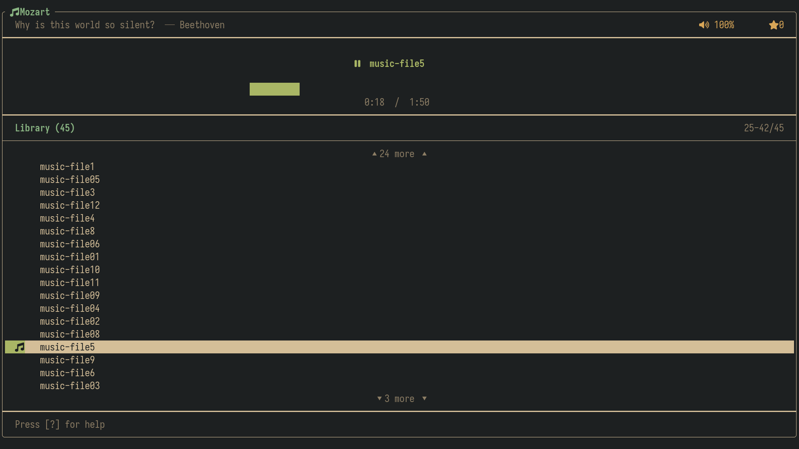

# Mozart - terminal music player

A fast, minimal and suckless TUI music player.
On Linux, Mozart registers itself as `org.mpris.MediaPlayer2.mozart` on the
session bus, so it shows up in MPRIS-aware status bars (e.g. Waybar's `mpris`
module) and media control tools. On other platforms it builds without MPRIS.

    make MPRIS=1    # Linux build with MPRIS (default on Linux)
    make MPRIS=0    # universal build without MPRIS

## Dependencies

- libVLC
- FTXUI
- C++20 compiler
- sdbus-c++ 2.x (Linux only, for MPRIS support)

## Installation

### NixOS

#### With NUR 
If you prefer Home Manager use the following:

    home.packages = with pkgs; [
        nur.repos.yashsio.mozart
    ];

If you don't use Home Manager use the following:

    environment.systemPackages = [
        nur.repos.yashsio.mozart
    ];

#### User level installation

Run the following command from the directory containing flake.nix

    nix profile install .#mozart

#### Build and run locally (for testing)

To build and run without installing:

    nix build
    ./result/bin/mozart

    or 

    nix run

Or with make (have to use "nix develop" command first):

    make && ./mozart

### Other Distributions

Just run the following command (if necessary as root) : 

    make clean install

## License
Licensed under [GPL-3.0](LICENSE)
